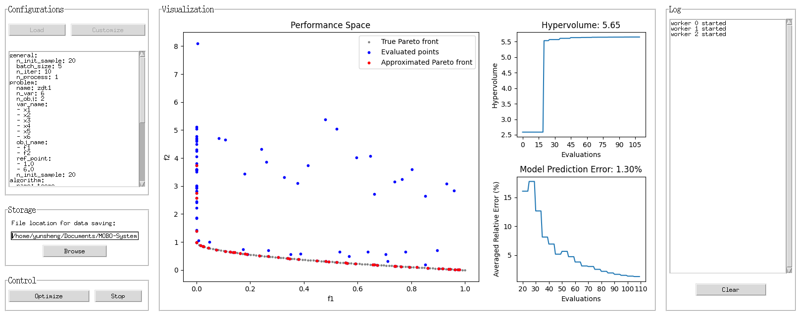
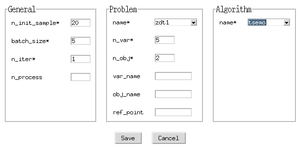

# MOBO-System

## Installation

Install by conda:

```
conda env create -f environment.yml
conda activate mobo
```

Or directly install major dependencies from pip:

```
pip install numpy scipy argparse autograd cma cython matplotlib pandas pymoo pymop pyyaml sklearn
```

Tested with Python 3.7 on Ubuntu 18.04.

## Getting Started

```
python run.py
```

This command will run MOBO optimization using configurations specified from GUI interaction, with interactive tkinter-based GUI and SQLite database for data storage.

## GUI




