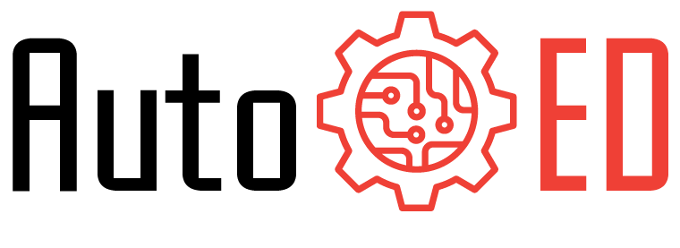

 [](https://www.python.org/downloads/release/python-370/) [](LICENSE) 

**AutoOED: Automated Optimal Experimental Design Platform**

**[Paper (under review)] | [Documentation](https://autooed.readthedocs.io/) | [Contact](mailto:autooed@csail.mit.edu)**

AutoOED is an optimal experimental design platform powered with automated machine learning to accelerate the discovery of optimal solutions. Our platform solves multi-objective optimization problems and automatically guides the design of experiment to be evaluated. 

AutoOED is developed by [Computational Design & Fabrication Group](https://cdfg.mit.edu/) at [MIT Computer Science and Artificial Intelligence Laboratory](https://www.csail.mit.edu/). See our motivation behind this project in this article covered by MIT CSAIL Alliances Newsletter: *[New MIT CSAIL Open-Source Project Automates Experimental Design Optimization](https://cap.csail.mit.edu/new-mit-csail-open-source-project-automates-experimental-design-optimization-0)*.

## Overview

AutoOED is a powerful and easy-to-use tool written in Python for design parameter optimization with multiple objectives, which can be used for any kind of experiment settings (chemistry, material, physics, engineering, computer science…). AutoOED aims at improving the sample efficiency of optimization problems, i.e., using less number of samples to achieve the best performance, by applying state-of-the-art machine learning approaches, which is most powerful when the performance evaluation of your problem is expensive (for example, in terms of time or money). 

One of the most important features of AutoOED is an intuitive graphical user interface (GUI), which is provided to visualize and guide the experiments for users with little or no experience with coding, machine learning, or optimization. Furthermore, a distributed system is integrated to enable parallelized experimental evaluations by multiple processes on a single computer.

<p>
   	
    
</p>

## Installation

AutoOED can be installed either directly from the links to the executable files, or from source code. Source code is the most up-to-date version, while executable files are relatively stable. AutoOED generally works across all Windows/MacOS/Linux operating systems.  After installation, there are some extra steps to take if you want to link your own evaluation programs to AutoOED for fully automatic experimentation.

### Executable files

Please see the [instructions](https://autooed.readthedocs.io/en/latest/content/getting-started/installation.html) in our documentation for directly installing executable files.

### Source code

#### Step 1: General (Required)

Install by conda with pip:

```
conda env create -f environment.yml
conda activate autooed
pip install -r requirements_extra.txt
```

Or install purely by pip:

```
pip install -r requirements.txt
pip install -r requirements_extra.txt
```

*Note: We recommend to install with Python 3.7, because we have not tested on other versions. If you cannot properly run the programs after installation, please check if the version of these packages match our specifications.*

#### Step 2: Custom Evaluation Programs (Optional)

There is some more work to do if you want to link your own evaluation programs to AutoOED to achieve fully automated experimentation, please see our [documentation](https://autooed.readthedocs.io/) for more details.

## Getting Started

After installing from source code, please run the following command to start AutoOED.

```bash
python run_gui.py
```

For more detailed usage and information of AutoOED, please checkout our [documentation](https://autooed.readthedocs.io/en/upgrade/).


## Contributing

We highly welcome all kinds of contributions, including but not limited to bug fixes, new feature suggestions, more intuitive error messages, and so on.

Especially, [the algorithmic part](https://github.com/yunshengtian/AutoOED/tree/upgrade/autooed/mobo) of our code repository is written in a clean and modular way, facilitating extensions and tailoring the code, serving as a testbed for machine learning researchers to easily develop and evaluate their own multi-objective Bayesian optimization algorithms. We are looking forward to supporting more powerful optimization algorithms on our platform.

## Contact

If you experience any issues during installing or using the software, or if you want to contribute to AutoOED, please feel free to reach out to us either by creating issues on GitHub or sending emails to autooed@csail.mit.edu.
