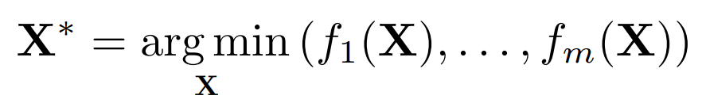
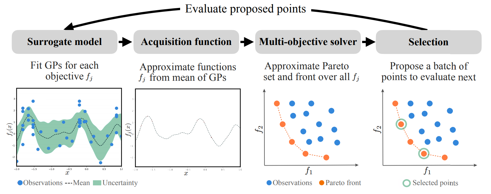

''''''''''
Background
''''''''''

Optimal Experimental Design
---------------------------

Optimal Experimental Design encompasses the concepts of proposing and analyzing various data samples with the goal of providing the most useful information with the least amount of expense. 
To accomplish this, a focus is placed on finding data samples which cannot be improved without a tradeoff to at least one other performance criteria, these points are considered Pareto-optimal. 
These Pareto-optimal samples are found by applying global optimization methodolgies which try to minimize across a given dataset using various mathematical methods. 

Multi-Objective Optimization
----------------------------

Given a design optimization problem with *d* design parameters and *m* different conflicting objectives:

.. figure:: ../../_static/about/background/setup1.png
   :width: 500 px

our goal is to find the optimal set of design samples

that minimizes the objectives with different trade-offs, called Pareto set. The set of optimal objective
values is called Pareto front.

To this end, many population-based
multi-objective evolutionary algorithms (MOEA) are proposed, e.g., NSGA-II [1]_ and MOEA/D
[2]_, which are widely used in various multi-objective problems, including financial portfolio design
[3]_, manufacturing design [4]_, and optimal control [5]_. However, MOEA algorithms typically
require a substantial number of evaluations due to the nature of evolutionary computation. This
requirement prevents them from being applied to many real-world problems, where the evaluation can
be computationally expensive and becomes the main bottleneck of the whole optimization process.

Multi-Objective Bayesian Optimization
-------------------------------------

Bayesian Optimization (BO) is originated from [6]_ [7]_, and was popularized by the Efficient
Global Optimization (EGO) algorithm [8]_. BO achieves a minimal number of function evaluations
by utilizing the surrogate model and sampling guided by carefully designed selection criteria.

Taking the best of both worlds from multi-objective optimization (MOO) and BO, 
multi-objective Bayesian optimization (MOBO) is designed to solve multi-objective problems
that are expensive to evaluate, e.g. DGEMO [9]_. This is achieved by the following iterative process: 

Repeat until a stopping criterion is met:

1. Fit surrogate models for each objective based on the current dataset, which map from design input to performance output.
2. Extract acquisition functions from the fitted surrogate models (e.g. mean functions) which serve as
   evaluation functions purely based on the surrogate models.
3. Run a multi-objective solver (e.g. MOEA) on the acquisition functions to approximate the
   Pareto set and front, which results in a set of candidate samples for selection.
4. Select a single sample or a batch of samples to evaluate next with according to some criteria.
5. Evaluate the selected samples on the real problem and add the evaluation results to the dataset.

References
----------

.. [1] Kalyanmoy Deb, Amrit Pratap, Sameer Agarwal, and TAMT Meyarivan. A fast and elitist multiobjective genetic algorithm: Nsga-ii. IEEE transactions on evolutionary computation, 6(2):182–197, 2002.

.. [2] Qingfu Zhang and Hui Li. Moea/d: A multiobjective evolutionary algorithm based on decomposition. IEEE Transactions on Evolutionary Computation, 11(6):712–731, 2007.

.. [3] Raj Subbu, Piero P Bonissone, Neil Eklund, Srinivas Bollapragada, and Kete Chalermkraivuth. Multiobjective financial portfolio design: A hybrid evolutionary approach. In 2005 IEEE Congress on Evolutionary Computation, volume 2, pages 1722–1729. IEEE, 2005.

.. [4] Adriana Schulz, Harrison Wang, Eitan Grinspun, Justin Solomon, and Wojciech Matusik. Interactive exploration of design trade-offs. ACM Transactions on Graphics (TOG), 37(4):1–14, 2018.

.. [5] Adrian Gambier and Essameddin Badreddin. Multi-objective optimal control: An overview. In 2007 IEEE International Conference on Control Applications, pages 170–175. IEEE, 2007.

.. [6] Harold J Kushner. A new method of locating the maximum point of an arbitrary multipeak curve in the presence of noise. 1964.

.. [7] Jonas Mockus. On bayesian methods for seeking the extremum. In Optimization techniques IFIP technical conference, pages 400–404. Springer, 1975.

.. [8] Donald R Jones, Matthias Schonlau, and William J Welch. Efficient global optimization of expensive black-box functions. Journal of Global optimization, 13(4):455–492, 1998.

.. [9] Mina Konaković Luković, Yunsheng Tian, and Wojciech Matusik. Diversity-guided multi-objective bayesian optimization with batch evaluations. In Advances in Neural Information Processing Systems 33, NeurIPS 2020, December 6-12, 2020, virtual, 2020.
