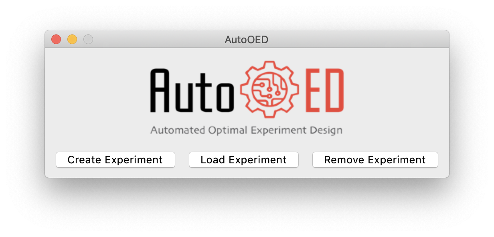
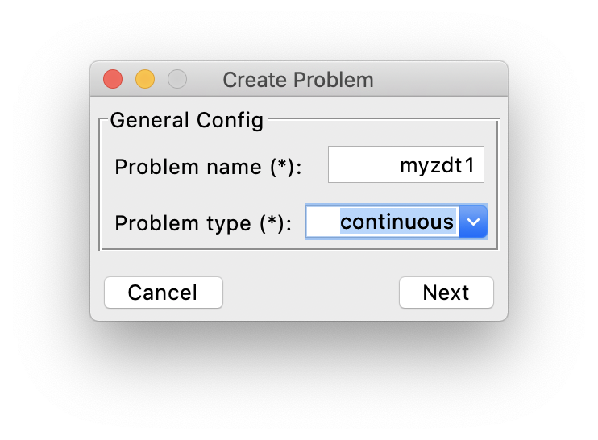
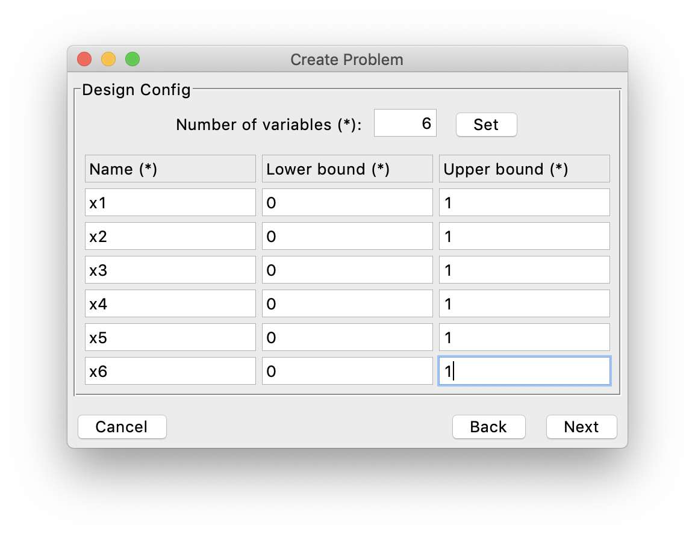
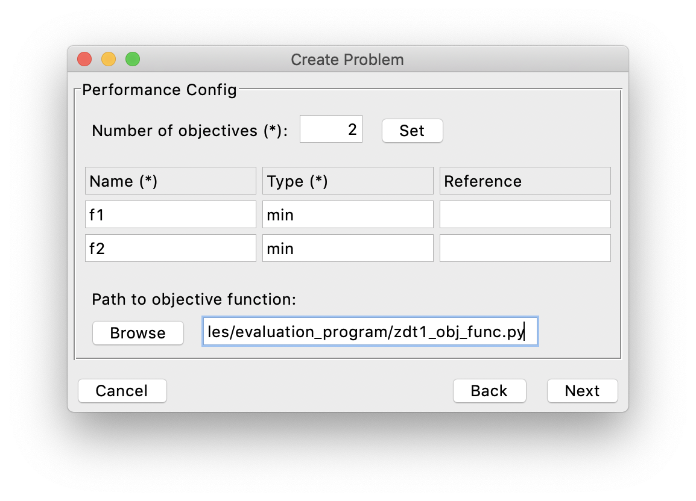
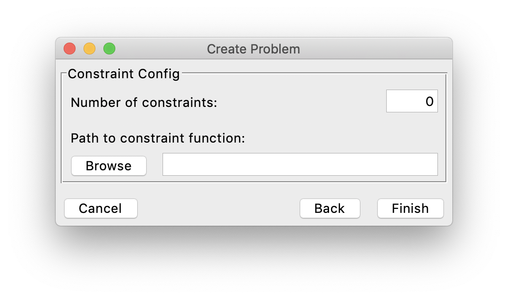
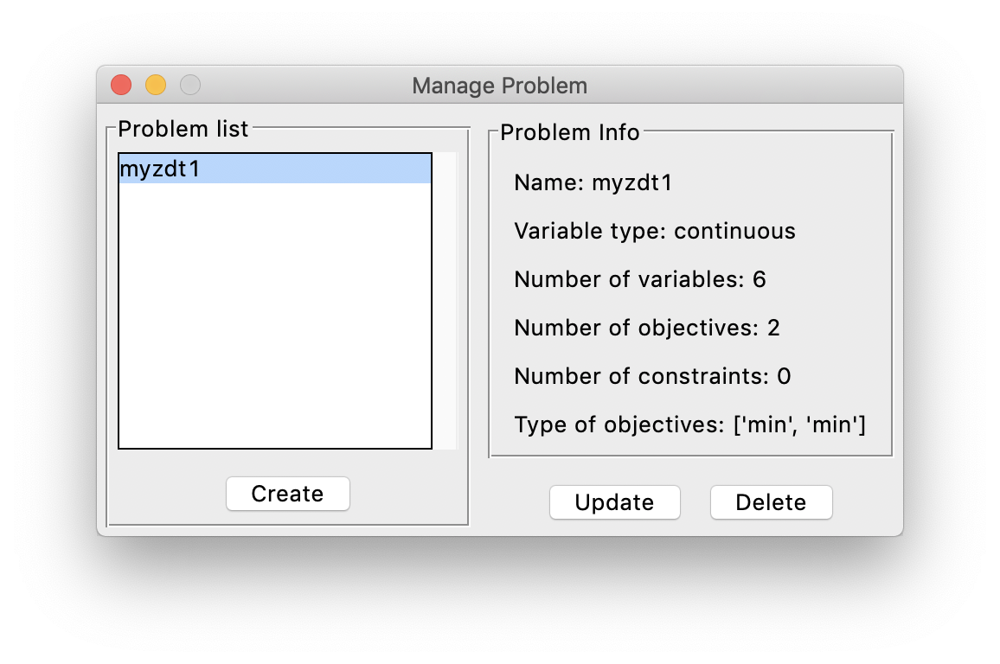
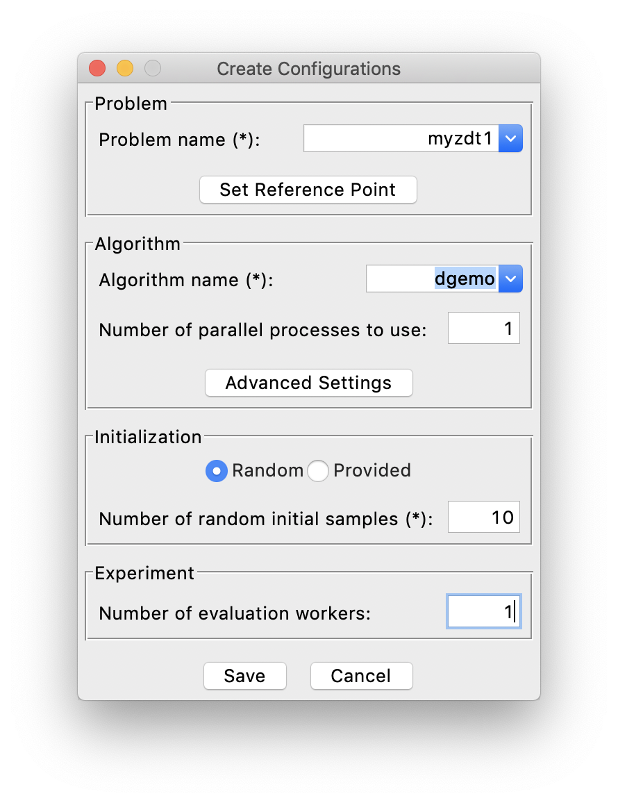
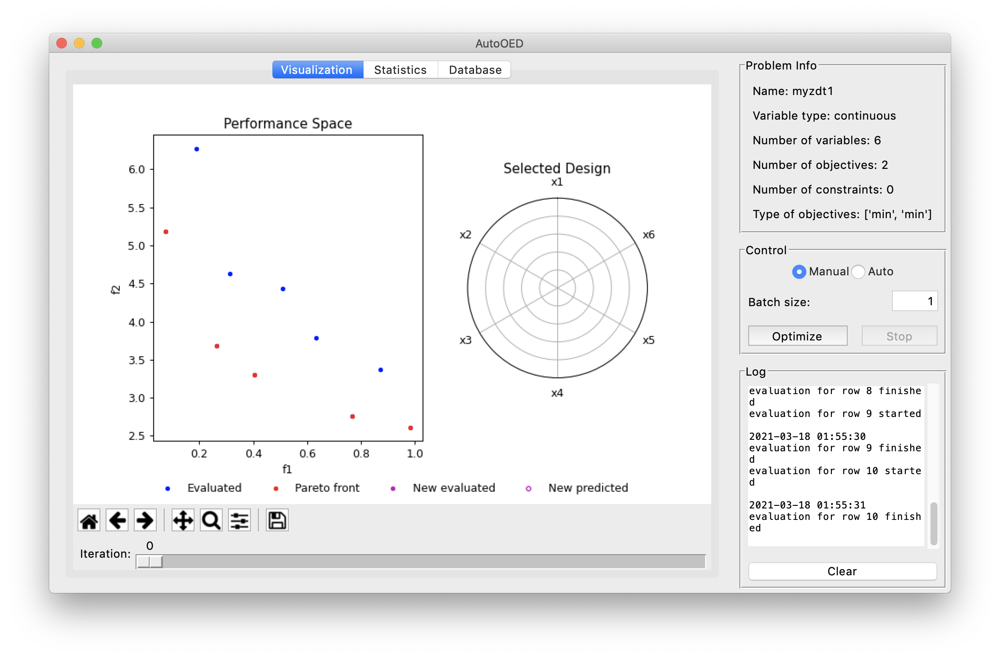

-----------
Basic Usage
-----------

In this section, we will briefly illustrate how to use AutoOED through a very simple test case. 
More detailed explanations of AutoOED can be found in the User Manual of this documentation.

Step 1: Starting Software
-------------------------

If you directly installed the executable file of the software, then simply double-click the executable file to start.
Otherwise, if you installed the software through source code, please run 

.. code-block::

   python run_gui.py

The software will start with this window:

Next, click ``Create Experiment``.

.. figure:: ../../_static/manual/software-entry/create.png
   :width: 300 px

You need to input a name for your new experiment, which cannot be the same as existing experiments. 
Then, click ``Create`` to create the experiment, and AutoOED will enter the main interface:

.. figure:: ../../_static/manual/software-entry/main.png
   :width: 700 px

Step 2: Building Problem
------------------------

Now we are going to build a problem for optimization. 
Click ``Problem->Manage`` from the menu, then this window will show:

.. figure:: ../../_static/getting-started/basic-usage/build-problem/manage_before.png
   :width: 500 px

The list of the current problems that have been created is shown on the left, which is empty now.
We can start by clicking ``Create``. 
Just as an example, we create the continuous ZDT1 [1]_ optimization problem, named "myzdt1".

Next, we specify the information of the design variables. In this problem, we have 6 design variables
bounded by 0 and 1.

After that, we specify the information of the performance space. In this problem, we have 2 objectives
that are supposed to be minimized.

And we have linked a performance evaluation program (objective function) for this problem, 
which is a simple python script like this, defined by the original ZDT1 problem 
(you can find this script at examples/evaluation_program/zdt1_obj_func.py):

.. code-block:: python

    import numpy as np

    def evaluate_objective(x):
        n_var = 6
        f1 = x[0]
        g = 1 + 9.0 / (n_var - 1) * np.sum(x[1:])
        f2 = g * (1 - np.power((f1 / g), 0.5))
        return f1, f2

As the last step, we specify the information of the constraints. But in this case, the problem does not have any constraints,
so it appears like:

Finally, we click ``Finish`` and the problem list gets updated:

Step 3: Building Experiment
---------------------------

Now let us get back to the main interface. After building the problem, now we are building an experiment to optimize that problem.

.. figure:: ../../_static/manual/software-entry/main.png
   :width: 700 px

Click ``Config->Create`` from the menu, then this window will show:

.. figure:: ../../_static/getting-started/basic-usage/build-experiment/create_before.png
   :width: 400 px

First, we select our "myzdt1" problem that we just created from the problem list. 
Next, we choose "DGEMO" as the optimization algorithm, using only 1 process (and of course, more processes means faster optimization).
Then, we want to have a random initialization with 10 samples generated by AutoOED.

Finally, we can click ``Save`` to build the experiment without worrying about other optional parameters.

Step 4: Running Optimization
----------------------------

Then we can see the initialization is taking place and the software interface becomes:

We can see our 10 initial samples from the performance space figure, where they are colored as blue and the Pareto-optimal ones are colored as red.
When you double click some points in the performance space, the values of the corresponding design variables will appear on the radar plot shown on the right.

Next, we set the batch size as 5 and click the ``Optimize`` button for optimizing our first batch of samples, the optimzation results will be like:

.. figure:: ../../_static/getting-started/basic-usage/run-optimization/main_optimized.png
   :width: 700 px

As you can see, AutoOED proposes 5 new samples that significantly outperform the initial samples, which are shown in magenta and become the new Pareto front.
And since we have the performance evaluation program linked when we created the problem, AutoOED automatically evaluates them such that their performance appear in the performance space figure.

Besides the visualization for performance space and the selected design sample, here is the statistics of our optimization history:

.. figure:: ../../_static/getting-started/basic-usage/run-optimization/statistics.png
   :width: 700 px

And here is the display for the database which stores all the historical data.

.. figure:: ../../_static/getting-started/basic-usage/run-optimization/database.png
   :width: 700 px

Currently we have only optimized the problem for only 1 iteration, but you can continue on that until you are satisfied with the results.

Concluding Remarks
------------------

So that is it! We have shown you how to start the software, build the problem and the experiment for optimization, and run the real optimization using AutoOED.
This is just a very brief introduction of a simple use case. For more details, we suggest you go through the user manual and explore more advanced features of AutoOED.
Hope our software can boost your experiments!

Reference
---------

.. [1] Eckart Zitzler, Kalyanmoy Deb, and Lothar Thiele. Comparison of multiobjective evolutionary algorithms: Empirical results. Evolutionary computation, 8(2):173–195, 2000.
