----------------------------
Example: Physical Experiment
----------------------------

A physical experimental setup was used to demonstrate the integration of an automated testing apparatus with the software pipeline.

Problem Setup
-------------

The setup comprises of a brushless DC motor, with an indicator wheel connected to an arduino for remote control.
Data collection was implemented using computer vision and a USB camera, allowing for the location of the indicator wheel to be measured.
Design space parameters comprised of the amount of time of the motor being on, the amount of power delivered to the motor, the amount of power used to stop the motor, and the amount of time required for stopping the motor.
For performance, both power usage and error in the intended rotation were measured and optimized. 

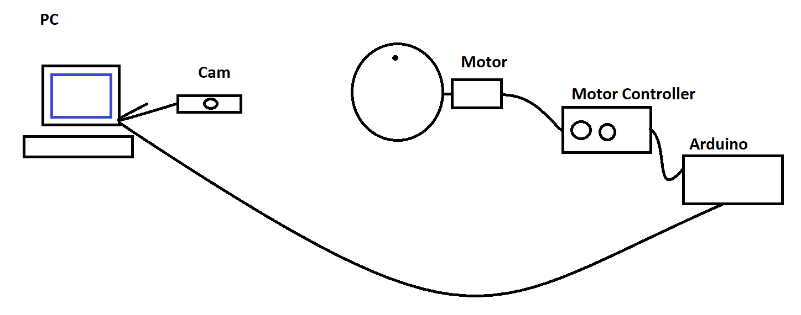

   A simple sketch of the experimental setup.

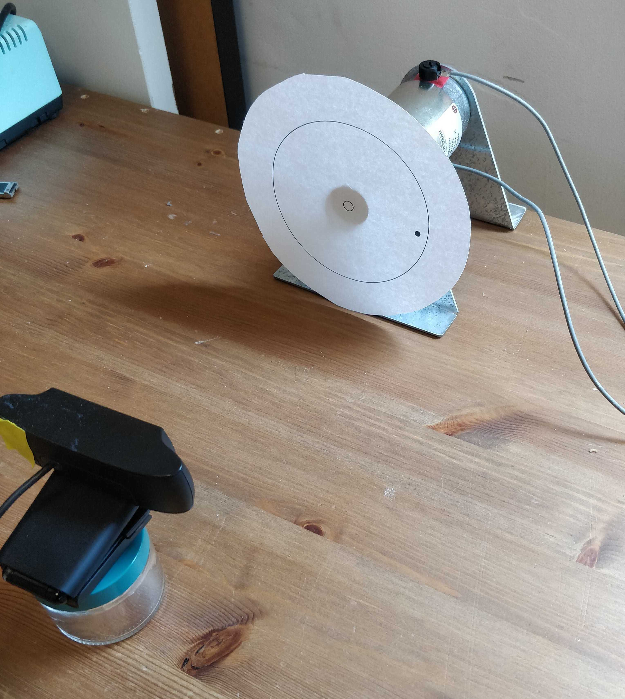

   A real photo of the experimental setup. 
   There is a camera shown at the bottom left, and a disc connected with the motor shown at the top right.
   The connections between the physical devices and PC are omitted from this photo.

The system is designed so that design space parameters can be passed directly to the microcontroller to be processed.
Python code has been implemented to take the array of design parameters requested by the algorithm, and format it in a method that the microcontroller can understand.
In the case of our implementation, this is a string comprised of the four potential parameters, passed along via a serial connection to the Arduino.
These commands are processed by the Arduino and sent to the motor controller, which applies appropriate pulse width modulation to modify the amount of energy the motor recieves.
A single cycle of the motor is then processed based on these parameters. 

In addition to the system for processing commands and moving the motor, an image processing system is layered ontop of the control software.
When processing a command, an initial image is taken for the starting location of the indicator wheel. 
The location of the wheel is computed using openCV, which detects the location of the outer circle of the indicator, and the indicating mark as well.
With the outer circle detected, the center of the wheel can be located and used for calculating the angle of the indicating mark.
Images are taken until the movement of the motor has stopped, and the total displacement of the angle can be calculated. 
This value is then returned from the software stack to AutoOED, and the process can be repeated.

Prerequisites
-------------

We encourage you to read `Basic Usage <basic-usage.html>`_ section first to familiarize yourself with some basic and important procedures of AutoOED.

We will skip the illustration of how to start the software because it is very straightforward and has been previously described in the `Starting Software <basic-usage.html#step-1-starting-software>`_ section.

Step 1: Building Problem
------------------------

Click ``Problem->Manage`` from the menu, then this window will show:

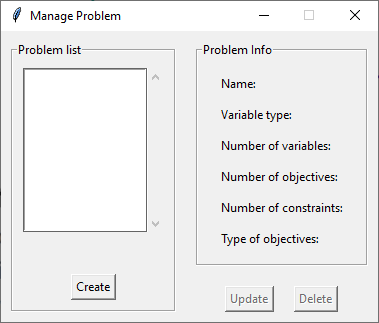

The list of the current problems that have been created is shown on the left, which is empty now.
We can start by clicking ``Create``, and name our problem as "Physical".

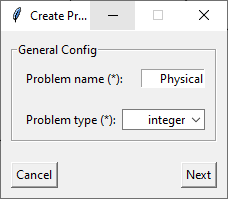

Here since our design space involves four integer variables, we need to specify our problem type as "integer".
Next, we specify the detailed information of the design variables, including the range of each variable.

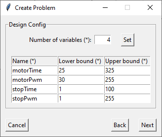

After that, we specify the information of the performance space. In this problem, we have 2 objectives
that are supposed to be minimized (f1 means the error in the intended rotation, f2 means power usage, and you can actually change the names here).

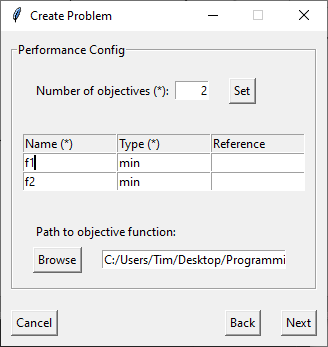

And we have linked a performance evaluation program (objective function) for this problem, 
which basically evaluates the error between the rotated angle and our target angle (90 degrees in this case)
as the first objective, and the power usage as the second objective.
The evaluation program is written in Python and shown as below.
More details of the imported ``motorExperiment`` package will be uploaded soon.

.. code-block:: python

   # objective_func.py
   from motorExperiment import testObject

   def evaluate_objective(x):
       motorTime, motorPwm, stopTime, stopPwm = x
       a = testObject()
       angle = a.runTest(motorTime,motorPwm,stopTime,stopPwm)
       a.disconnect()
       return (angle - 90) ** 2, motorTime * motorPwm + stopTime * stopPwm

As the last step, we specify the information of the constraints.

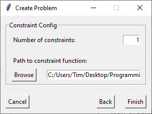

In this case, the problem has one constraint which basically ensures that the rotated angle does not exceed 360 degrees.
We link the corresponding constraint evaluation program which is also written in Python and shows as below.

.. code-block:: python

   # constraint_func.py
   def evaluate_constraint(x):
      motorTime, motorPwm, stopTime, stopPwm = x
      # using fit data to make sure we don't rotate more than once.
      return motorTime - 3324 * motorPwm**-0.815

Finally, we click ``Finish`` and the problem list gets updated:

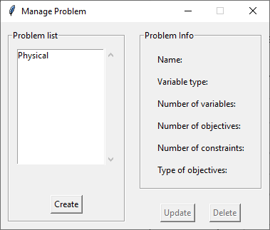

Step 2: Building Experiment
---------------------------

After building the problem, now we are building an experiment to optimize that problem.
Click ``Config->Create`` from the menu and enter the corresponding information of the experiment,
which may looks like this:

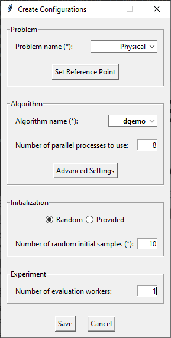

In this example, we select our "Physical" problem that we just created from the problem list. 
Next, we choose "DGEMO" as the optimization algorithm, and by default it runs in parallel using the count of CPUs as number of parallel processes.
Then, we want to have a random initialization with 10 samples generated by AutoOED.
Finally, we can click ``Save`` to build the experiment without worrying about other optional parameters.

Step 3: Running Optimization
----------------------------

After building the experiment, we can see the initialization is taking place from the main interface. 

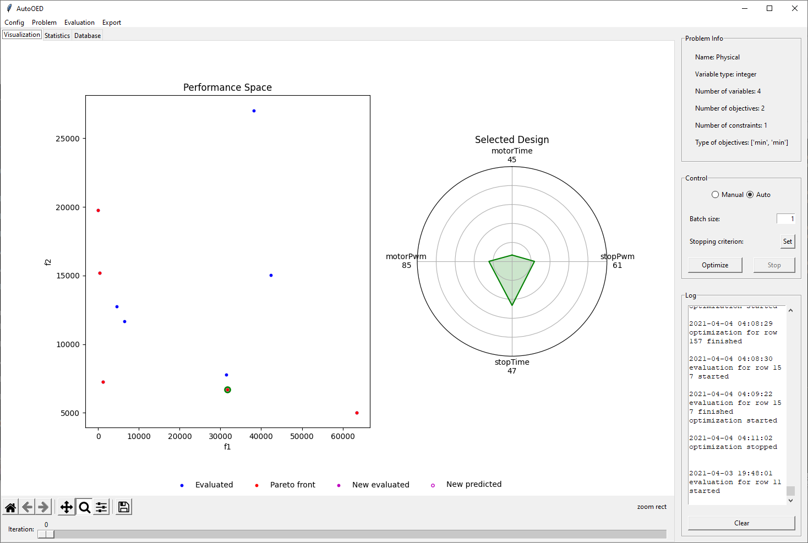
   
We can see our 10 initial samples from the performance space figure, where they are colored as blue and the Pareto-optimal ones are colored as red.
When you double click some points in the performance space, the values of the corresponding design variables will appear on the radar plot shown on the right.

After the initialization is done, we can select ``Auto`` mode in the control panel and let the optimization run
in a fully automated fashion. Finally the results will look like this:

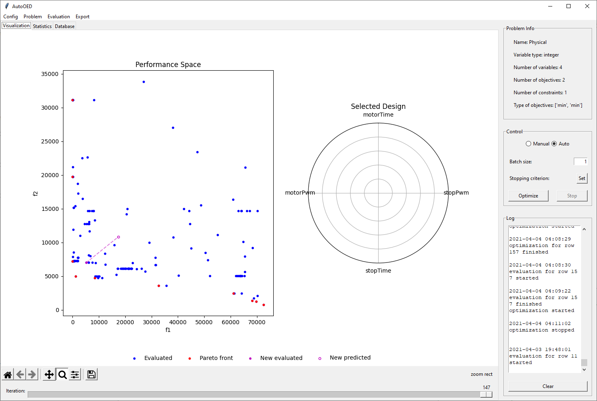

Here are some optimization statistics, especially the hypervolume curve, showing the progress of our optimization.
We observe a huge improvement in terms of the hypervolume with only 160 total sample evaluations.

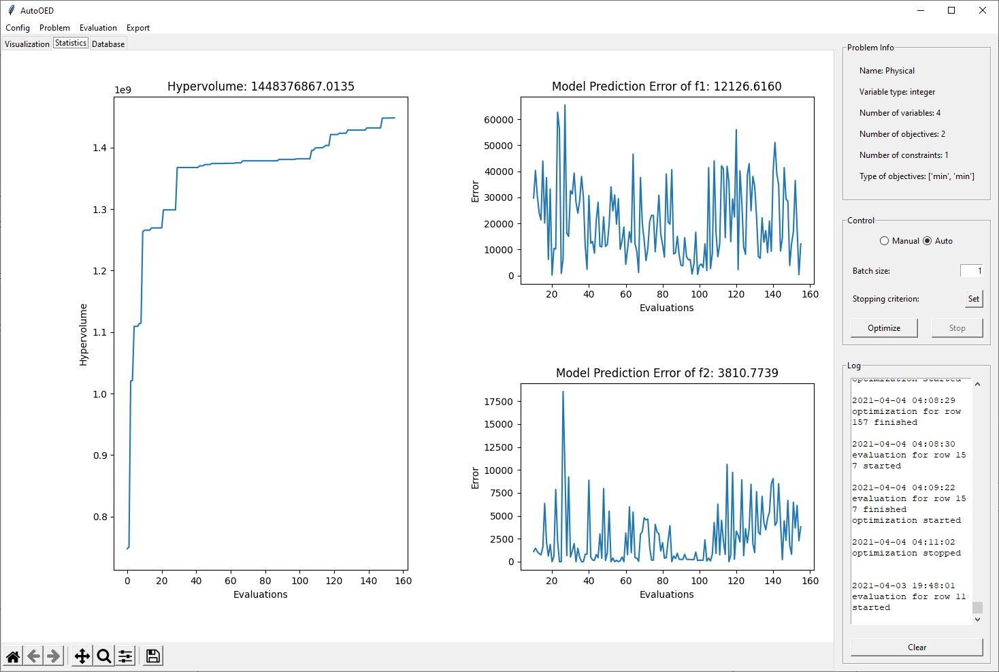

In addition, here is the display for the database which stores all the historical data.

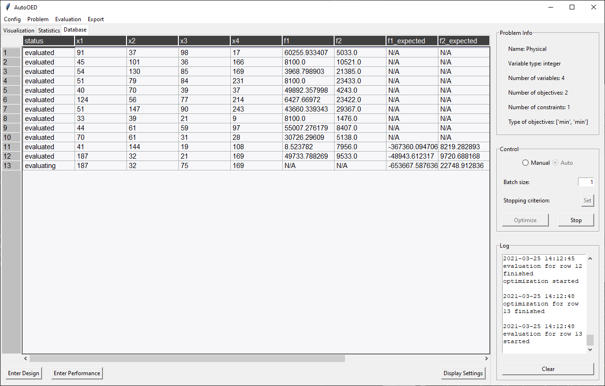

You can further export the whole database, or some statistics or figures by clicking ``Export`` from the menu.
This is the end of this tutorial, and we suggest you go through the user manual and explore more advanced features of AutoOED.
