------------------------------
Example: Simulation Experiment
------------------------------

For a simulation example, we show how the software can interface with a MATLAB function to simulate and optimize a mechanical bracket's stiffness and weight using finite element analysis.

Problem Setup
-------------

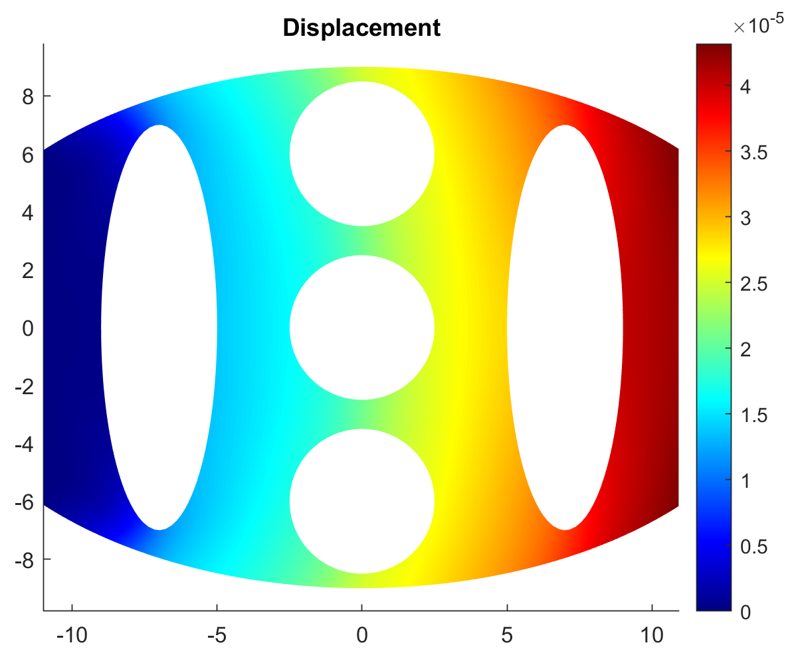

The bracket, as an example is shown in the figure above, is used to transfer a normal load to the left surface of the bracket. 
The simulation's primary objective is to find an optimal geometry and material for the bracket to have maximal stiffness and minimal weight. 
To reduce the bracket's weight, three holes of radius, *d3*, and two ellipses of height *d2* and width *d1*, are added to the bracket's cross-section. 
The bracket can also be made from 3 different materials that have different stiffness moduli and densities. 
AutoOED is used to suggest the design parameters of *d1*, *d2*, *d3*, and the bracket material that have the designs with maximal stiffness and minimal weight.

Prerequisites
-------------

We encourage you to read `Basic Usage <basic-usage.html>`_ section first to familiarize yourself with some basic and important procedures of AutoOED.

Since our evaluation program is written in MATLAB, we need to first follow some additional `instructions <installation.html#matlab-extension>`_ 
in order to let AutoOED recognize the MATLAB software on our local computer. And you can find the source code of our evaluation program at 
`the bottom of this page <example-simulation.html#code-of-evaluation-program>`_ (less than 100 lines).

We will skip the illustration of how to start the software because it is very straightforward and has been previously described in the `Starting Software <basic-usage.html#step-1-starting-software>`_ section.

Step 1: Building Problem
------------------------

Click ``Problem->Manage`` from the menu, then this window will show:

.. figure:: ../../_static/getting-started/example-simulation/build-problem/manage_before.png
   :width: 500 px

The list of the current problems that have been created is shown on the left, which is empty now.
We can start by clicking ``Create``, and name our problem as "matlab".

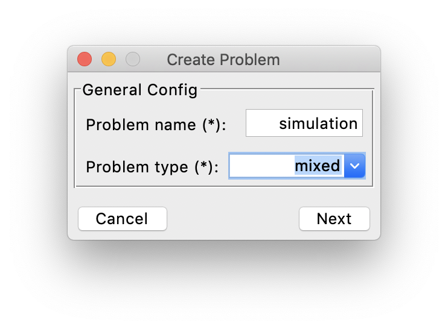

Here since our design space involves three continuous variable *d1*, *d2*, *d3* 
and an integer variable *mat* (for material, 1 = aluminum, 2 = steel, 3 = nylon), we need to specify our problem type as "mixed".
Next, we specify the detailed information of the design variables, including the range of each variable.

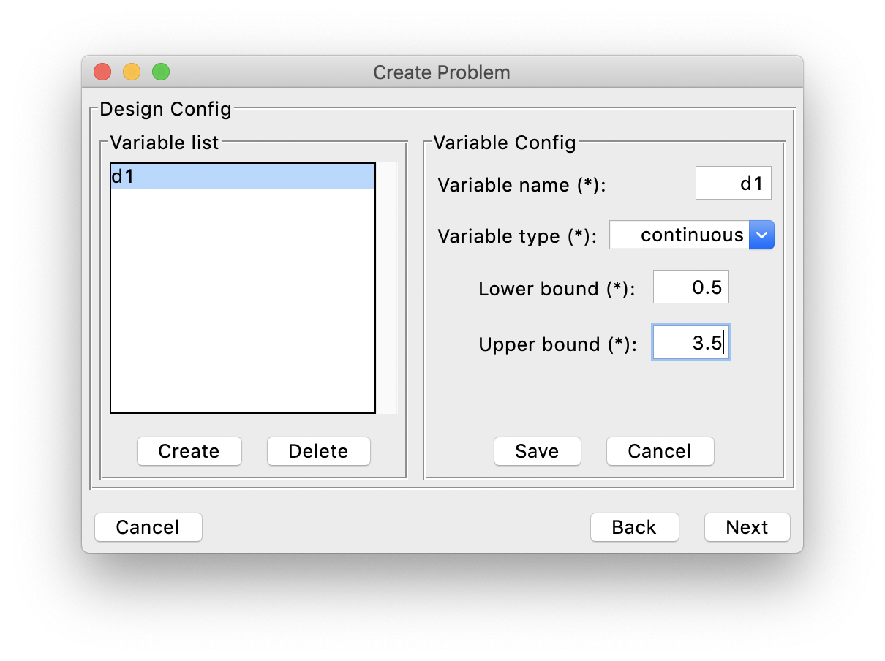

Above is an example for *d1* variable, and similarly we specify all the information for the remaining design variables.

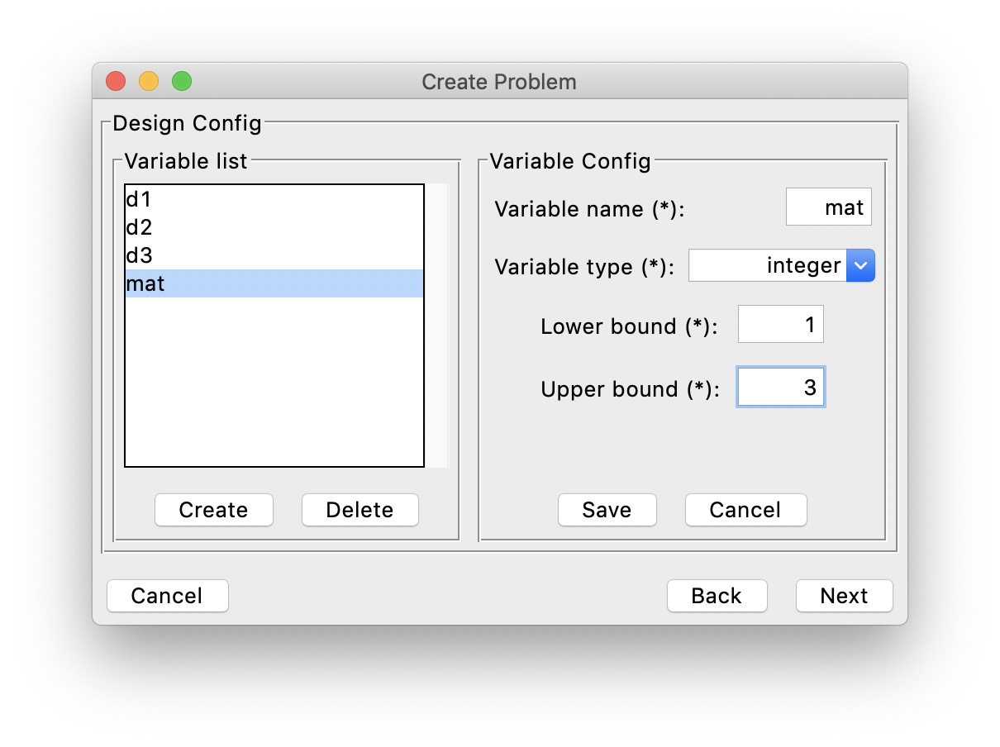

After that, we specify the information of the performance space. In this problem, we have 2 objectives
that are supposed to be minimized (f1 means max displacement, f2 means mass, and you can actually change the names here).

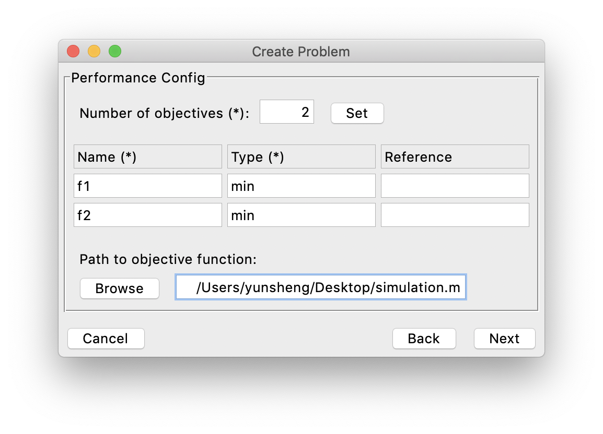

And we have linked a performance evaluation program (objective function) for this problem, 
which is the MATLAB evaluation program named *simulation.m* (see the code `here <example-simulation.html#code-of-evaluation-program>`_).

As the last step, we specify the information of the constraints. But in this case, the problem does not have any constraints,
so it appears like:

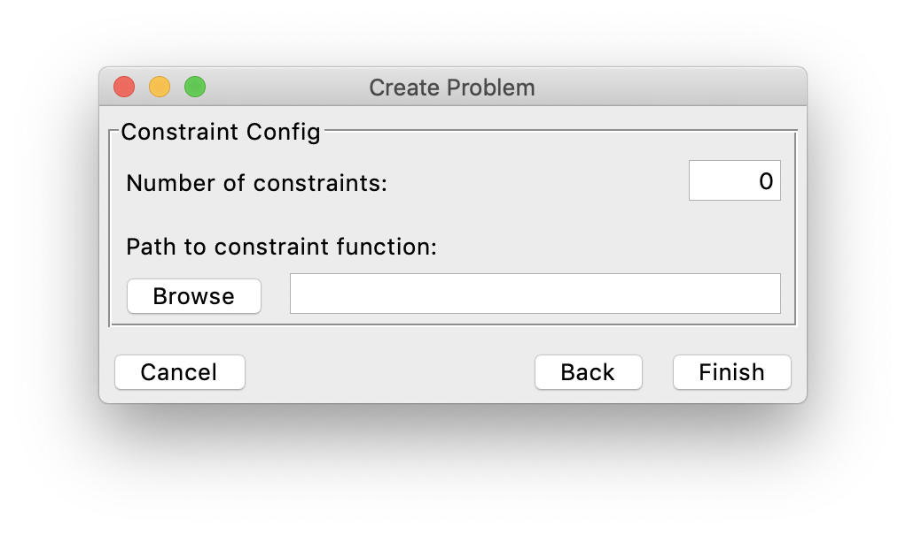

Finally, we click ``Finish`` and the problem list gets updated:

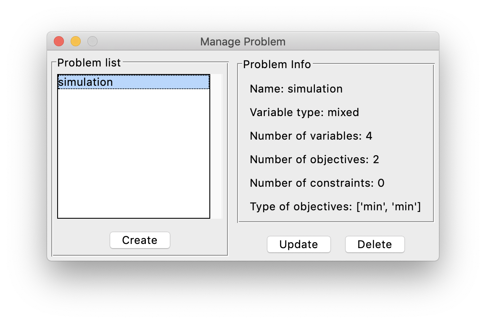

Step 2: Building Experiment
---------------------------

Now let us get back to the main interface. After building the problem, now we are building an experiment to optimize that problem.

.. figure:: ../../_static/manual/software-entry/main.png
   :width: 700 px

Click ``Config->Create`` from the menu, then this window will show:

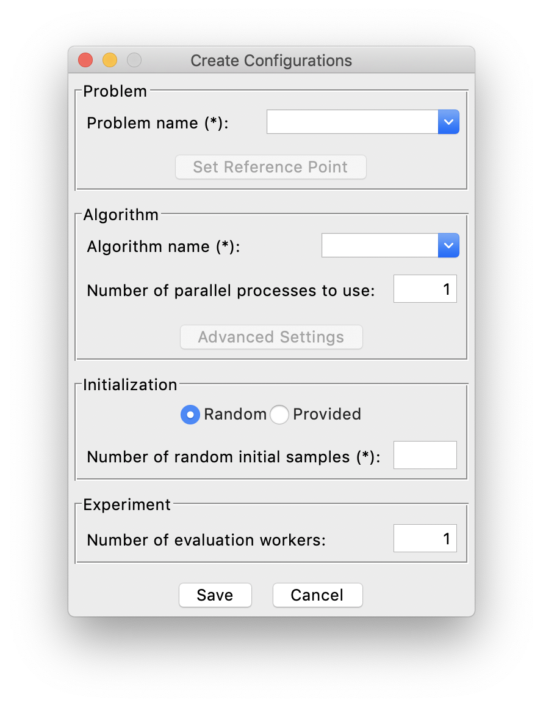

First, we select our "matlab" problem that we just created from the problem list. 
Next, we choose "DGEMO" as the optimization algorithm, and by default it runs in parallel using the count of CPUs as number of parallel processes.
Then, we want to have a random initialization with 10 samples generated by AutoOED.

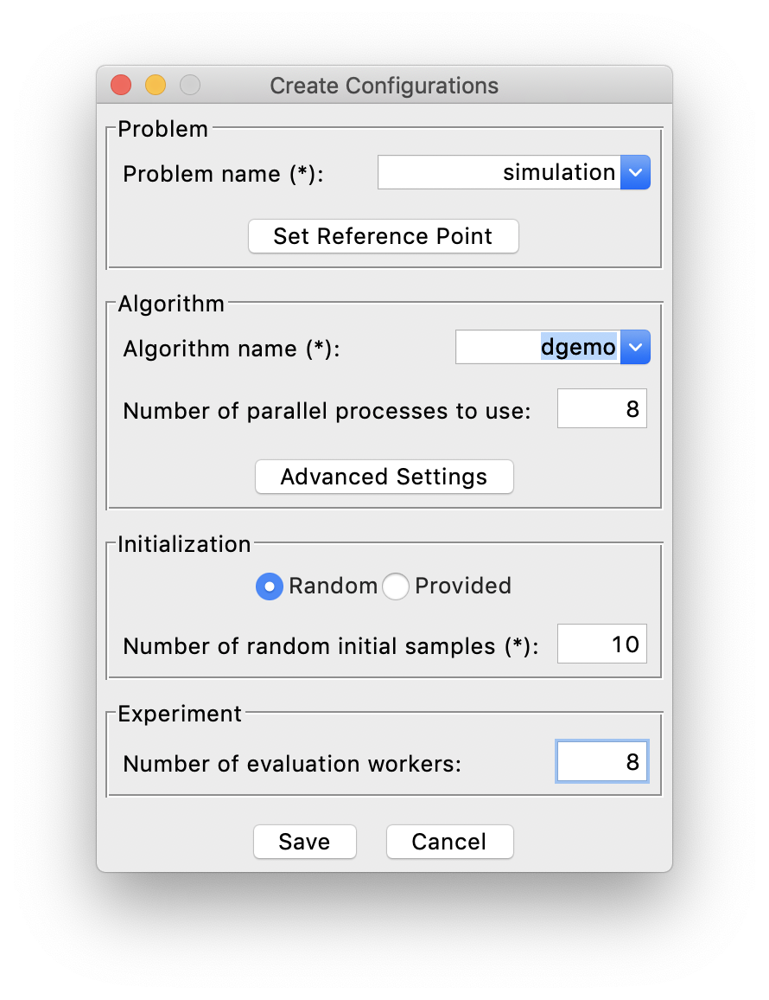

Finally, we can click ``Save`` to build the experiment without worrying about other optional parameters.

Step 3: Running Optimization
----------------------------

Then we can see the initialization is taking place and the software interface becomes:

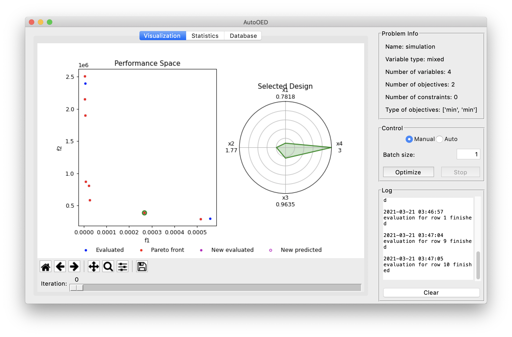

We can see our 10 initial samples from the performance space figure, where they are colored as blue and the Pareto-optimal ones are colored as red.
When you double click some points in the performance space, the values of the corresponding design variables will appear on the radar plot shown on the right.

Next, since we have linked an evaluation program, we can choose "Auto" in the Control panel for automatic scheduling of optimization and evaluations.
We set the batch size as 5 and set the stopping criterion in this way:

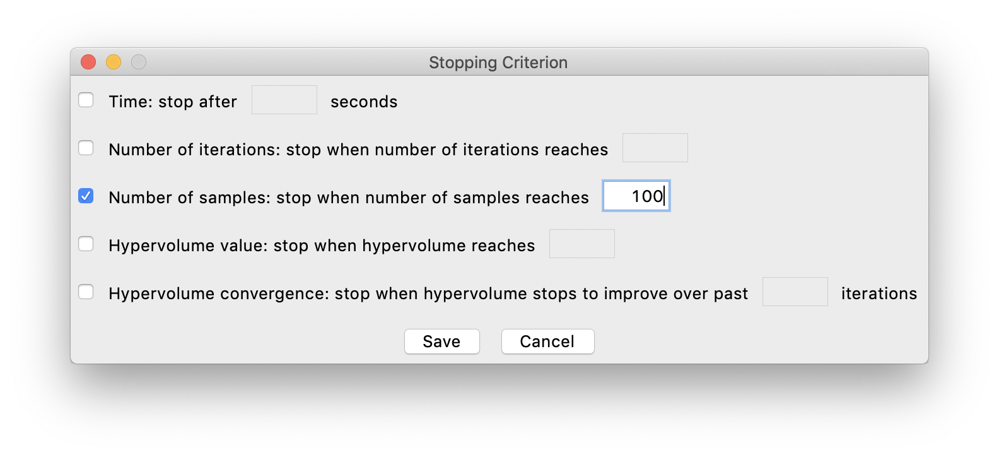

which means we stop the optimization after evaluating 100 samples.
Finally, we click the ``Optimize`` button for starting the optimization. 
The optimization is not an instant process because optimization algorithm takes some time and also the evaluation program usually runs very slow 
(and that's mainly why you want to use AutoOED for reducing the number of evaluations as many as possible).
Eventually the optimzation results will be like:

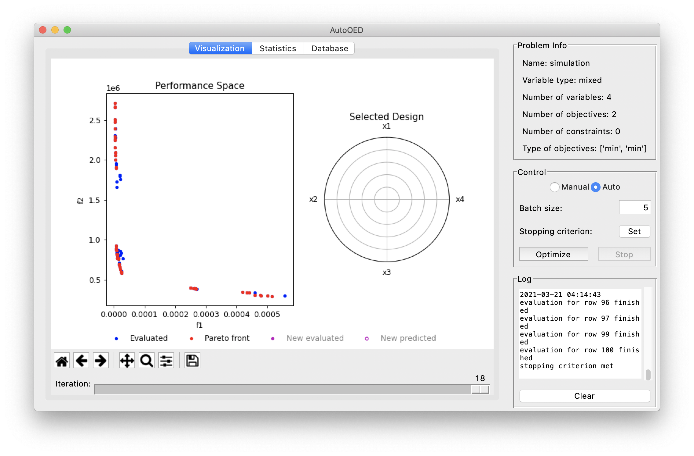

You can see the Pareto front we have found is actually divided into three regions. 
And if you take a closer look (e.g. double clicking the points and checking their design variables), 
you will find these three regions correspond to three different materials respectively.
So there is a clear trade-off of different objectives for these different materials.

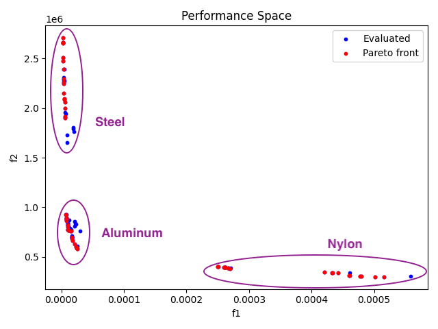

For other information of the optimization process, here is the statistics showing our optimization history:

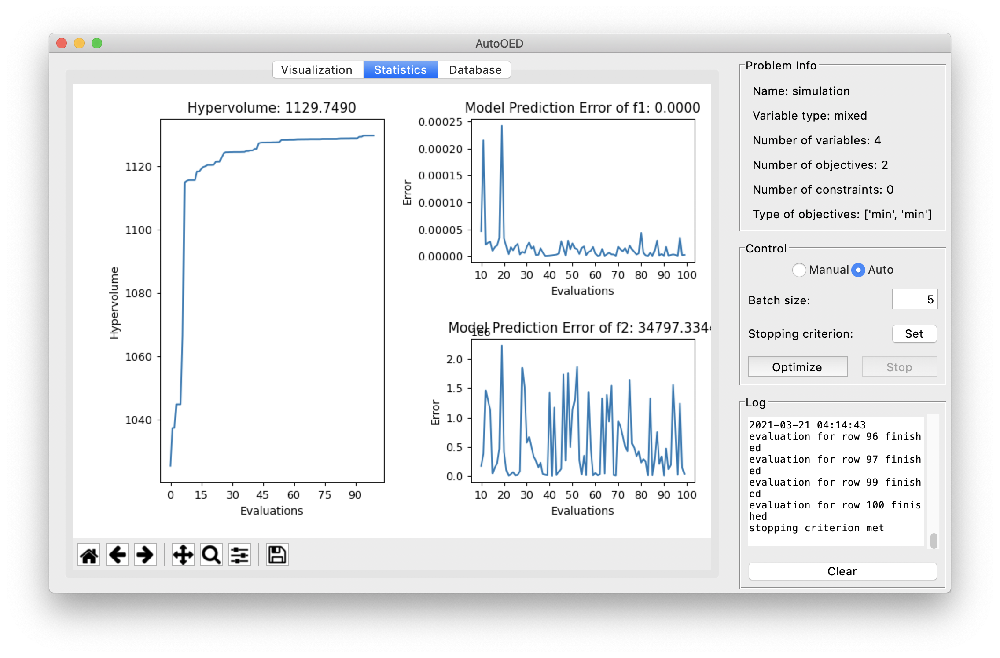

You can see that actually the optimization converged around 50 evaluations. And the surrogate model did a good job
in predicting f1 (max displacement) but less certain when predicting f2 (mass). 
That's actually very common in MOBO. Though a better predictive power sounds better for the surrogate model,
the optimization can still be done efficiently without a very good predictive model.
In addition, here is the display for the database which stores all the historical data.

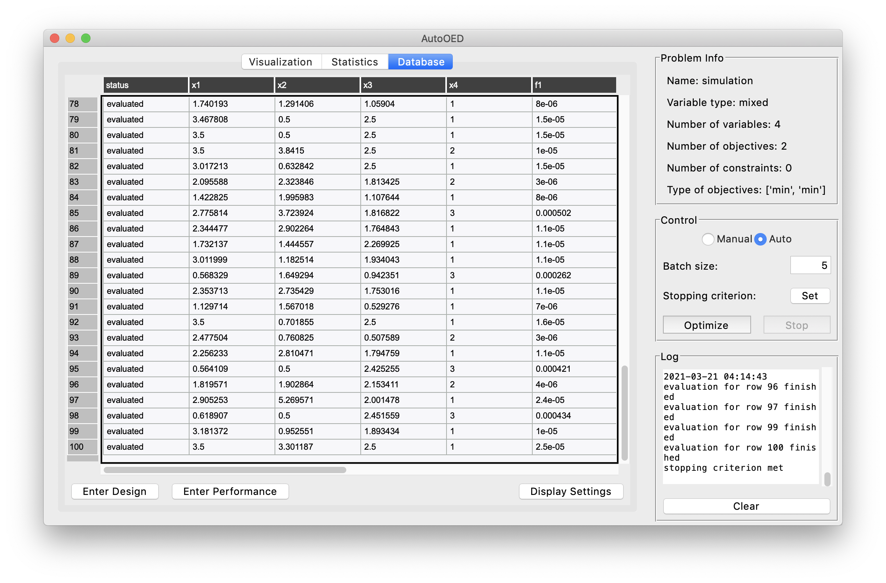

You can further export the whole database, or some statistics or figures by clicking ``Export`` from the menu.
This is the end of this tutorial, and we suggest you go through the user manual and explore more advanced features of AutoOED.

Code of Evaluation Program
--------------------------

The code is also available at examples/evaluation_program/simulation.m.

.. code-block:: matlab

    % simulation.m
    function [md,mass] = simulation(d1,d2,d3,mat)

        % Design parameters
        % d1   % Range: 0.5 to 3.5
        % d2   % Range: 0.5 to 7
        % d3   % Range: 0.5 to 2.5
        % mat   % 1 = aluminum, 2 = steel, 3 = nylon

        % Aluminum
        if mat == 1
            d = 2700;   % density (kg/m^3)
            ym = 70e9;  % Young's Modulus (Pa)
            pr = 0.33;  % Poisson's Ratio (-)

        % Steel
        elseif mat == 2
            d = 7800;   % density (kg/m^3)
            ym = 205e9; % Young's Modulus (Pa)
            pr = 0.29;  % Poisson's Ratio (-)
        
        % Nylon
        elseif mat == 3
            d = 1150; % density (kg/m^3)
            ym = 2e9; % Young's Modulus (Pa)
            pr = 0.4; % Poisson's Ratio (-)
        
        end
        
        t = linspace(0,2*pi,500)';
        xin = 15*cos(t);
        yin = 9*sin(t);
        
        indices = find(xin>11);
        len = length(xin)-2*length(indices);
        x1 = zeros(1,len)';
        y1 = zeros(1,len)';
        i = 1;
        
        for n = 1:size(xin)
            if xin(n) < 11 && xin(n) > -11
                x1(i) = xin(n);
                y1(i) = yin(n);
                i = i+1; 
            end
        end
        
        x2 = 7+d1*cos(t);
        y2 = d2*sin(t); 
        
        x3 = d1*cos(t)-7;
        y3 = d2*sin(t);
        
        x4 = d3*cos(t);
        y4 = 6+d3*sin(t);
        
        x5 = d3*cos(t);
        y5 = d3*sin(t)-6;
        
        x6 = d3*cos(t);
        y6 = d3*sin(t);
        
        pgon = polyshape({x1, x2, x3, x4, x5, x6},{y1, y2, y3, y4, y5, y6});
        tr = triangulation(pgon);
        model = createpde('structural','static-planestress');
        tnodes = tr.Points';
        telements = tr.ConnectivityList';
        
        geometryFromMesh(model,tnodes,telements);
        generateMesh(model,'Hmax',0.25);

        structuralProperties(model,'YoungsModulus',ym,'PoissonsRatio',pr);
        structuralBC(model,'Edge',3,'Constraint','fixed');
        structuralBoundaryLoad(model,'Edge',2,'SurfaceTraction',[0;2000]);

        R = solve(model);
        
        mass = area(pgon)*d;
        md = max(R.Displacement.Magnitude);

    end