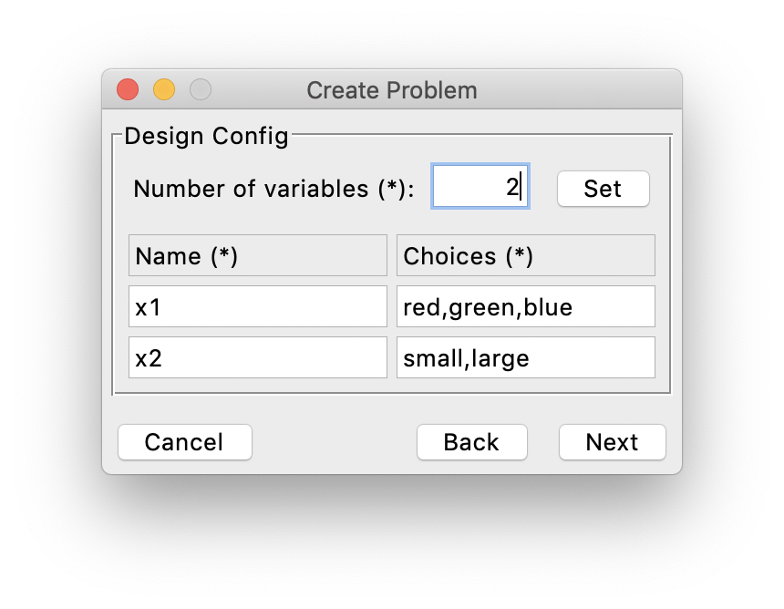
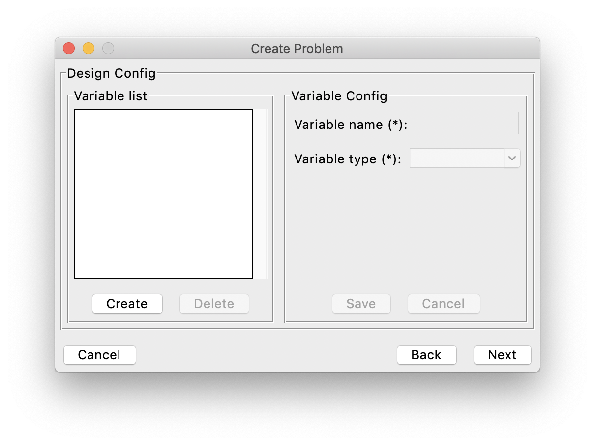
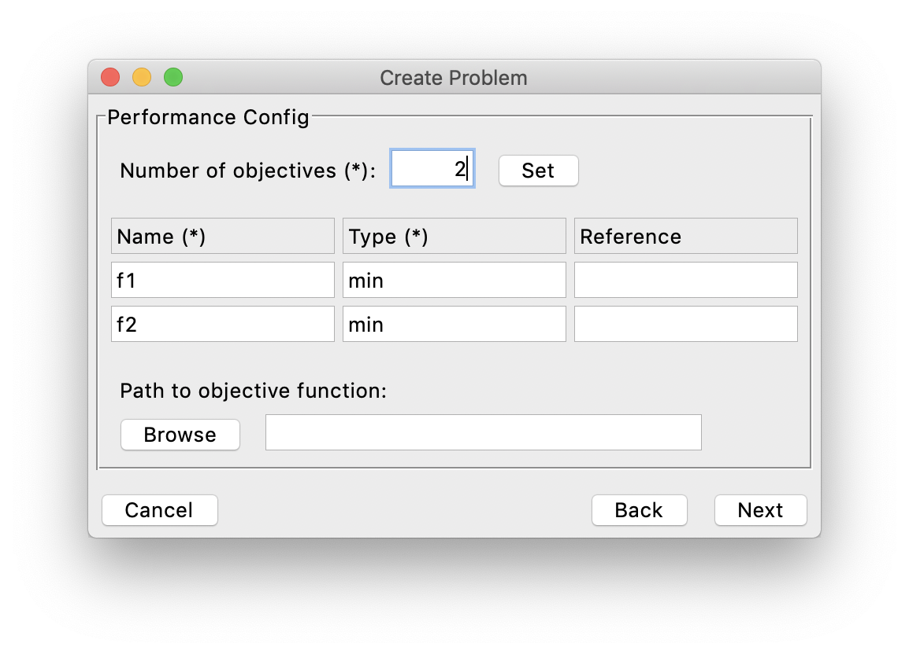

----------------
Building Problem
----------------

To build a problem to optimize in AutoOED, we need to create a problem configuration by either of the following ways: 
through interactions with GUI or through a configuration file.
Basically, a valid problem configuration should include necessary information of the design space and the performance space.

To build a problem interactively from GUI, first click ``Problem->Manage`` from the menu, then this window will show:

.. figure:: ../../_static/manual-personal/build-problem/manage.png
   :width: 500 px

The list of the current problems that have been created is shown on the left. You can click the ``Create`` button under that list to start creating the problem.
And the basic information of the current selected problem is shown on the right.
It is also possible to update the information of the problem after it is created or delete the problem, by clicking ``Update`` and ``Delete`` on the right respectively.

After clicking the ``Create`` button, a window will pop up like this, where you can enter the name and type of the problem 
(here type means the type of the design variables). 

.. figure:: ../../_static/manual-personal/build-problem/create_general.png
   :width: 400 px

For different types of problem, the window for entering design space information would be different.
You need to click ``Next`` to enter the information for the design space, and see the following subsections for different problem types respectively.

Design Space
''''''''''''

Continuous / Integer
""""""""""""""""""""

If the design variables are continuous or integer, first you need to set the number of design variables by entering the number in the top entry and clicking the ``Set`` button.
Next, after the window is refreshed, you need to specify the name, lower bound and upper bound of the variables.
For example:

.. figure:: ../../_static/manual-personal/build-problem/create_design_continuous.png
   :width: 500 px

Then click ``Next`` to move forward.

Binary
""""""

If the design variables are binary, first you need to set the number of design variables by entering the number in the top entry and clicking the ``Set`` button.
Next, after the window is refreshed, you need to specify only the name of the variables.
For example:

.. figure:: ../../_static/manual-personal/build-problem/create_design_binary.png
   :width: 400 px

Then click ``Next`` to move forward.

Categorical
"""""""""""

If the design variables are categorical, first you need to set the number of design variables by entering the number in the top entry and clicking the ``Set`` button.
Next, after the window is refreshed, you need to specify only the choices of the variables, where the different choices are separated by commas.
For example:

Then click ``Next`` to move forward.

Mixed
"""""

If the problem type is mixed, which means the problem involves different types of design variables,
the window looks different than the above ones because you need to specify each design variable separately.
Here is the initial window when no design variable is specified, where the variable list is on the left and the selected variable information is displayed on the right:

Next, to create a design variable, you can click the ``Create`` button on the left, and entering corresponding information on the right, 
then click ``Save`` to save this variable. You can also delete some created variables through clicking the ``Delete`` button.
Finally it might look like this, for example:

.. figure:: ../../_static/manual-personal/build-problem/create_design_mixed_final.png
   :width: 500 px

After all the design variables are specified correctly, click ``Next`` to move forward.

Performance Space
'''''''''''''''''

Now let us specify the information of the performance space. First you need to set the number of objectives by entering the number in the top entry and clicking the ``Set`` button.
Note currently AutoOED only supports 2 and 3 objectives, but we are working on supporting higher dimensions.
Next, after the window is refreshed, you can specify the name, type and reference point of each objective (optional).

Here the type means whether the objective needs to be minimized or maximized. So the possible values are "min" and "max".

The reference point is a point in the performance space based on which to calculate the hypervolume. 
By default if the values are not provided, the reference point will be calculated as the maximal objective value of the initial samples (or minimal if the objectives are being maximized).

Next, if you can provide a program that contains the evaluation function of the objectives, you can link this program to AutoOED by clicking ``Browse`` and select the program at the correct location.
After this, the platform is able to automatically call the evaluation program whenever some points proposed by the optimization algorithm need to be evaluated.

For details on how to write a valid performance evaluation program, see `this page <eval-program.html#performance-evaluation-program>`_.

Otherwise, AutoOED could also work without a written program for performance evaluation, just instead of automatically calling the program, 
the platform will expose the unevaluated design variables directly to you and you will have to do the evaluation manually, and later input the evaluation results back to AutoOED for further optimization.

Then, click ``Next`` to move forward.

Constraints
'''''''''''

Finally, as the last step of building a problem configuration, you need to provide the constraints of the problem if it has constraints, or just click ``Finish`` if there is no constraints.
(For now we only support constraints on the design variables.)

.. figure:: ../../_static/manual-personal/build-problem/create_constraint.png
   :width: 450 px

For details on how to write a valid constraint evaluation program, see `this page <eval-program.html#constraint-evaluation-program>`_.

The process of specifying constraints is very straightfoward: first, you only need to input the number of constraints to the top entry, 
then click the ``Browse`` button to link the program that contains the evaluation function of the constraints to AutoOED, 
such that AutoOED will be able to call the evaluation program during the optimization when it needs to evaluate whether the design variables are feasible.

After the constraint information is specified, click ``Finish`` to complete building the problem.
