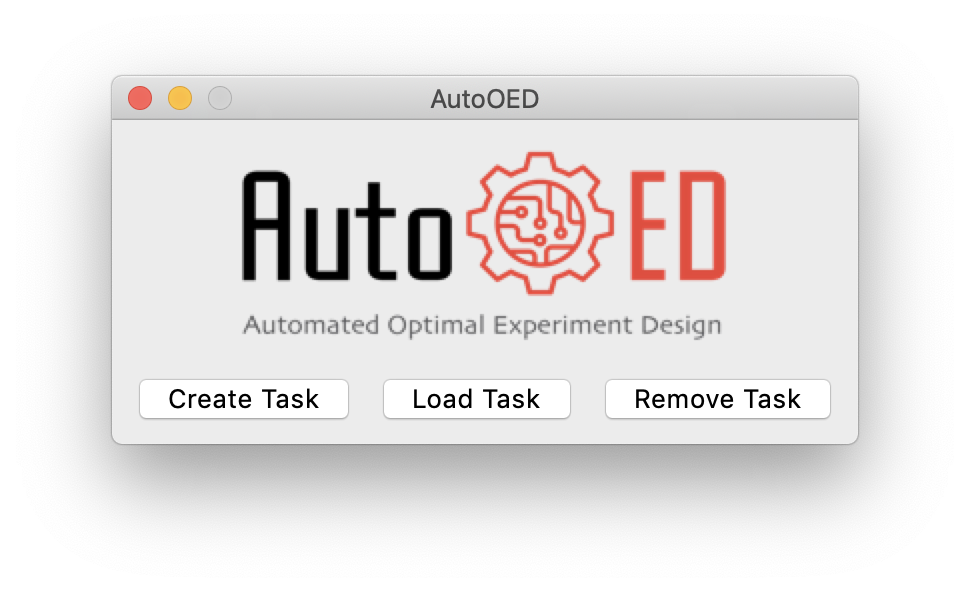
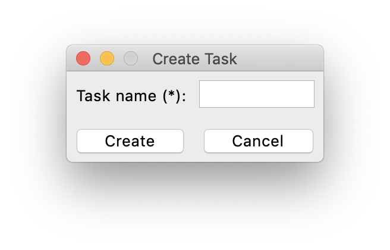
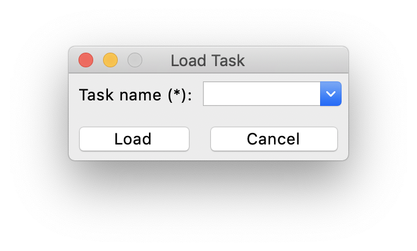
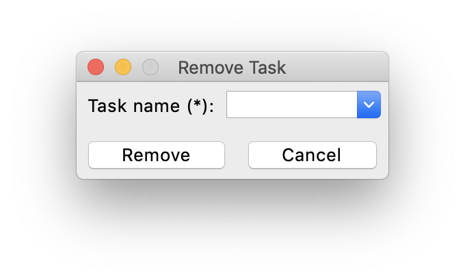

--------------
Software Entry
--------------

Welcome to the personal version of AutoOED! This section introduces how to start the software and create tasks for optimization.

Starting the Software
---------------------

If you directly installed the executable file of the software, then simply double-click the executable file to start.
Otherwise, if you installed the software through source code, please run 

.. code-block::

   python run_personal.py

The software will start with this window:

Managing Tasks
--------------

Since users will probably use AutoOED for multiple optimization tasks and maybe for different problems,
AutoOED supports task management through the three buttons shown in the screenshot above:

- ``Create Task`` for creating new optimization tasks.
- ``Load Task`` for loading existing tasks that were created before.
- ``Remove Task`` for removing existing tasks that are not useful anymore.

Creating Tasks
''''''''''''''

After clicking ``Create Task``, this window will pop up:

You need to input a name for your new task, which cannot be the same as existing tasks. Then, click ``Create`` to create the task.

Loading Tasks
'''''''''''''

After clicking ``Load Task``, this window will pop up:

You need to input the name of your existing task. Then, click ``Load`` to load that task.

Removing Tasks
''''''''''''''

After clicking ``Remove Task``, this window will pop up:

You need to input the name of the task you want to remove. Then, click ``Remove`` to remove that task.