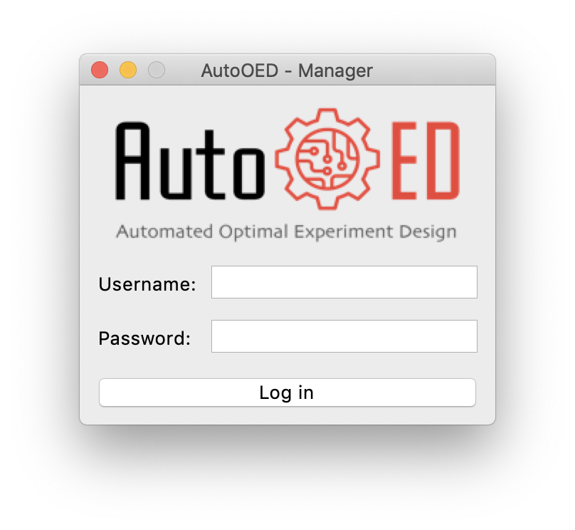
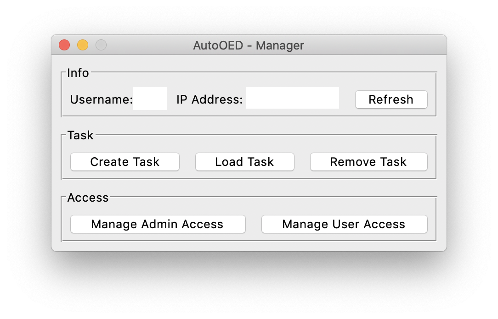
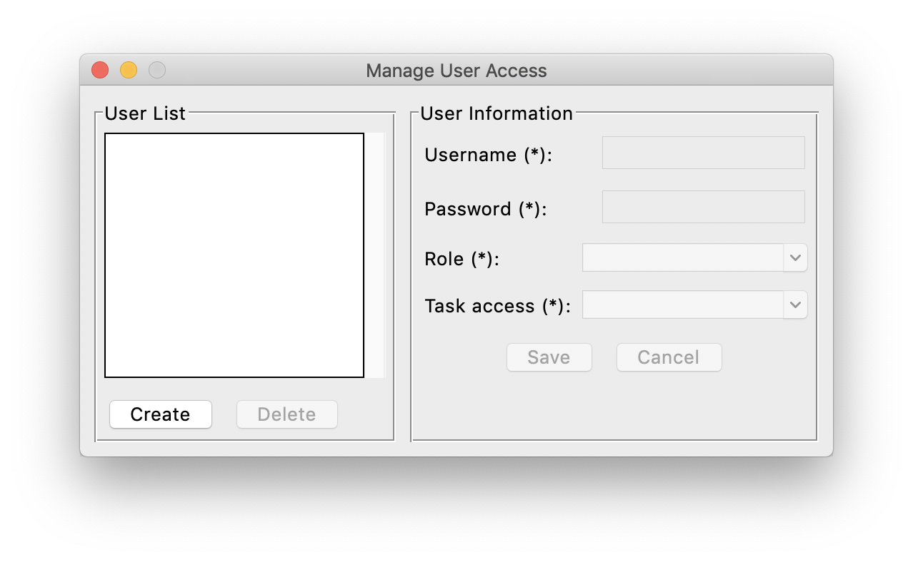

-------
Manager
-------

As the manager of the team, this application is responsible for managing the database and user access, 
also has the ability of checking the optimization status.

Login
-----

If you directly installed the executable file of the software, then simply double-click the executable file to start.
Otherwise, if you installed the software through source code, please run 

.. code-block::

   python run_team_manager.py

The software will start with this login window:

where you need to input username and password of the MySQL database to proceed.

Main Interface
--------------

After login, the main interface appears, where you can manage tasks and access. 

Managing Tasks
--------------

As a manager, you are the only role in the team that has the privilege of creating and removing tasks.
Also, you can load tasks to check the current optimization status.

Creating Tasks
''''''''''''''

After clicking ``Create Task``, this window will pop up:

.. figure:: ../../_static/manual-team/manager/create.png
   :width: 350 px

You need to input a name for your new task, which cannot be the same as existing tasks. Then, click ``Create`` to create the task.

Loading Tasks
'''''''''''''

After clicking ``Load Task``, this window will pop up:

.. figure:: ../../_static/manual-team/manager/load.png
   :width: 350 px

You need to input the name of your existing task. Then, click ``Load`` to load that task.

Removing Tasks
''''''''''''''

After clicking ``Remove Task``, this window will pop up:

.. figure:: ../../_static/manual-team/manager/remove.png
   :width: 350 px

You need to input the name of the task you want to remove. Then, click ``Remove`` to remove that task.

Managing User Access
--------------------

You can manage user access by clicking ``Manage User Access`` and entering this interface:

Initially, only you will have the access to all the tasks, 
but you cannot do any optimization or evaluation because these are the jobs of scientists and technicians. 
In order to let them in, you need to create users for them in this interface by clicking ``Create`` and entering 
corresponding information. 

When you are specifying the task access for users, the options include the access for the current tasks, 
empty for no access at all and \* for all tasks' access.

After the user is created, that user can login to AutoOED using the username and the password you specified through 
Scientist or Technican application.
