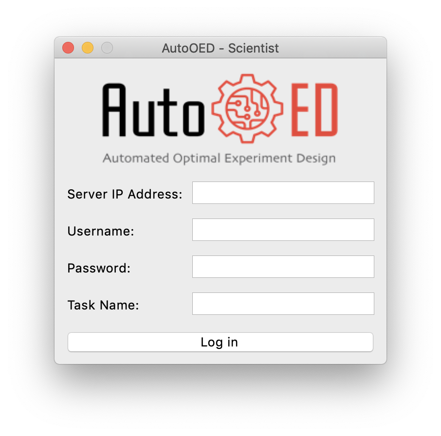

---------
Scientist
---------

As the scientist of the team, this application is responsible for creating problems and experiments, 
also executing optimization and evaluations.

Login
-----

If you directly installed the executable file of the software, then simply double-click the executable file to start.
Otherwise, if you installed the software through source code, please run 

.. code-block::

   python run_team_scientist.py

The software will start with this login window:

where you need to input the server IP (manager's IP), username and password of the MySQL database, 
also the specific task that manager has created for you to proceed.

After login, the interface will be exactly the same as the personal version of AutoOED.
You can refer to the `user manual for personal version <../manual-personal/overview.html>`_ for more details.
