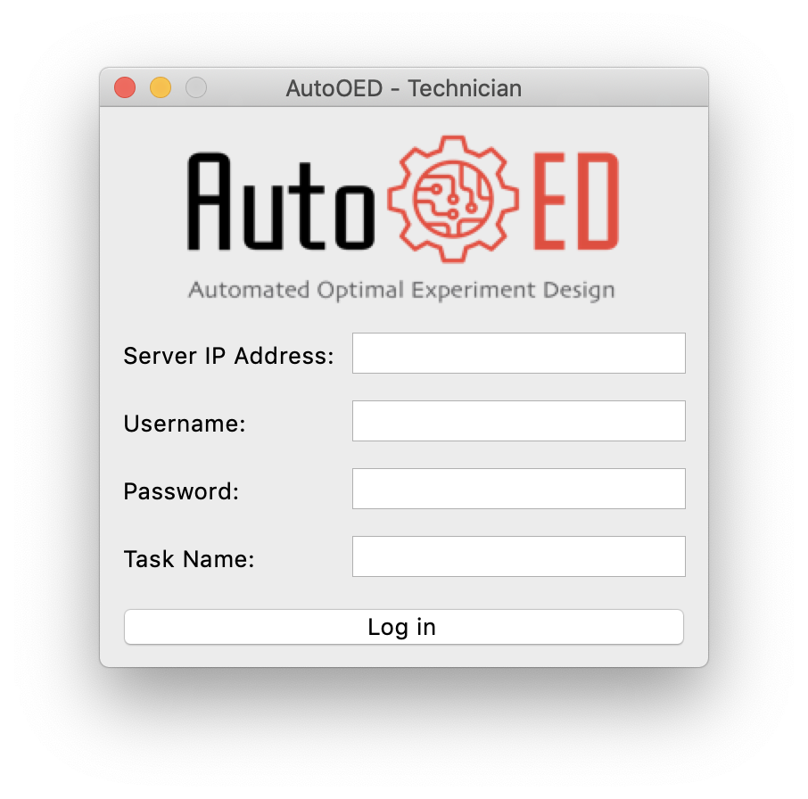
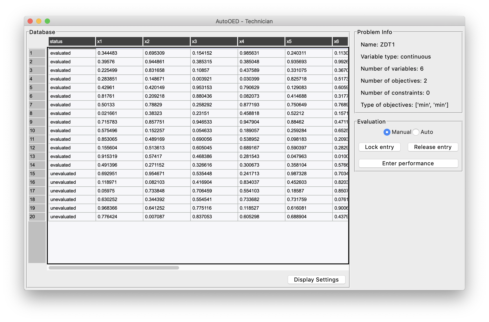
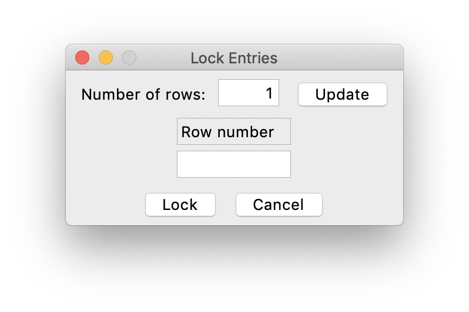
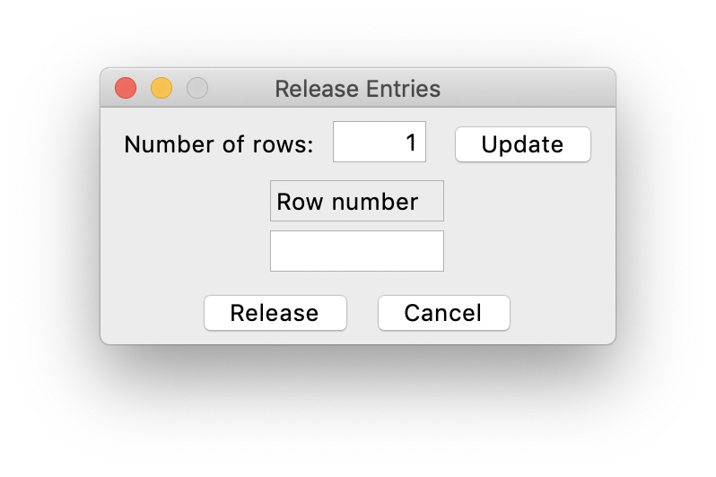
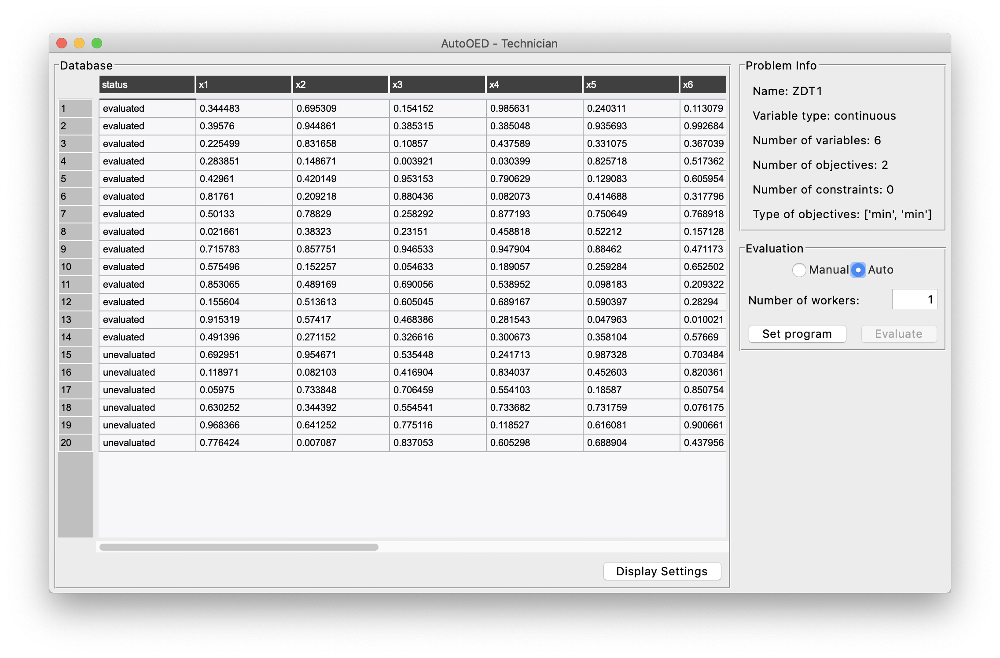
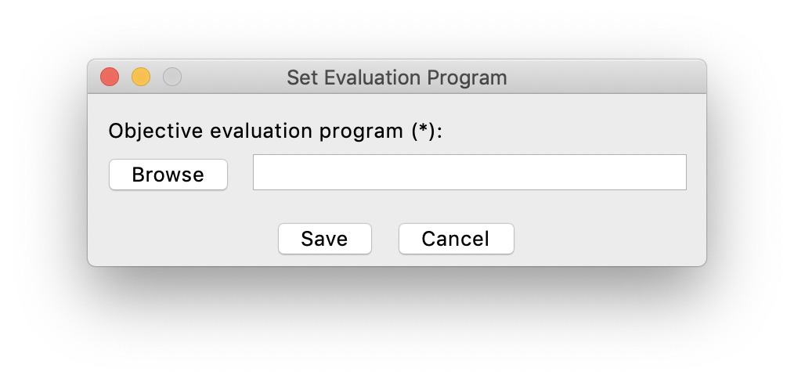
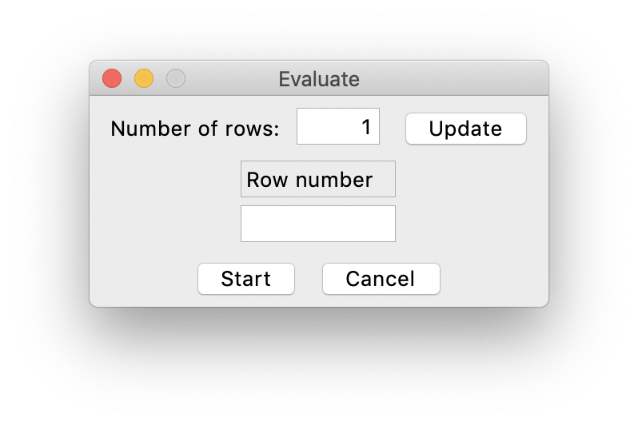

----------
Technician
----------

As a technician of the team, this application is only responsible for executing evaluations.

Login
-----

If you directly installed the executable file of the software, then simply double-click the executable file to start.
Otherwise, if you installed the software through source code, please run 

.. code-block::

   python run_team_technician.py

The software will start with this login window:

where you need to input the server IP (manager's IP), username and password of the MySQL database, 
also the specific task that manager has created for you to proceed.

Main Interface
--------------

After login, the main interface appears, where you can see the current database and execute evaluations.

Manual Evaluation
-----------------

If you do not have the performance evaluation program for your problem, you have to evaluate design variables manually.
As shown in the figure above, you can manually enter the performance of design variables by clicking ``Enter performance``.

.. figure:: ../../_static/manual-team/technician/enter_performance.png
   :width: 350 px

When entering the performance, you have to first set the number of rows you want to enter. 
After that, just fill the row numbers and the corresponding performance values. Finally click ``Save``.

In some cases when you have multiple Technician applications in your team running at the same time and you want to
avoid evaluation conflict, you can click ``Lock entry`` to lock certain rows that you want to evaluate on your own 
such that the performance of those rows cannot be entered by anyone when they are locked.

Similarly, you need to first set the number of rows you want to lock and then specify the row numbers and click ``Save``.

After that, when you have finished the evaluation of those rows and you want to release those rows to enter the
corresponding performance values, just click ``Release entry``.

First, set the number of rows you want to release and then specify the row numbers and click ``Save``.
Then you should be able to enter the performance values for those rows.

Auto Evaluation
---------------

If you have the performance evaluation program for your problem, you can evaluate design variables automatically in this way.
In the main interface, switch the mode from ``Manual`` to ``Auto`` like this:

Next, click ``Set program`` to link your evaluation program to AutoOED.

After the evaluation program is being set, you can get back to the main interface and click ``Evaluate``
for automatically calling the evaluation program to evaluate.

First, set the number of rows you want to evaluate and then specify the row numbers and click ``Start`` to start evaluations.
