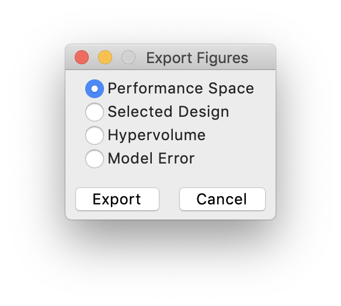

--------------
Exporting Data
--------------

AutoOED supports exporting all kinds of data related to the optimization, 
including the database data, optimization statistics and figures.

Database
--------

You can export the whole database as a CSV file by clicking ``Export->Database`` from the menu.
It will launch a system window asking you where should the CSV file be and the name of the file.
Following the instructions, you will see a CSV file generated like this:

.. figure:: ../../_static/manual/export-data/database.png
   :width: 700 px

Statistics
----------

You can export the whole history of hypervolume or model error as a CSV file by clicking ``Export->Statistics`` from the menu.
Then, a small window will pop up like:

.. figure:: ../../_static/manual/export-data/statistics.png
   :width: 300 px

You can select which statistics to export then click the ``Export`` button. Similarly, a system window will pop up
asking about the file location and file name. After that, the CSV file will be generated at the specified location.

Figures
-------

You can export the existing figures shown in AutoOED as separate image files (PNG by default) by clicking ``Export->Figures`` from the menu.
Then, a small window will pop up like:

You can select which figure to export then click the ``Export`` button. Similarly, a system window will pop up
asking about the file location and file name. After that, the image file will be generated at the specified location.
