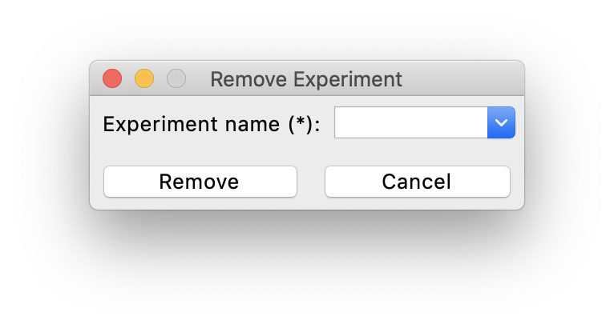

--------------
Software Entry
--------------

This section introduces how to start the software and create experiments for optimization.

Starting the Software
---------------------

If you directly installed the executable file of the software, then simply double-click the executable file to start.
Otherwise, if you installed the software through source code, please run 

.. code-block::

   python run_gui.py

The software will start with this window:

.. figure:: ../../_static/manual/software-entry/initial.png
   :width: 400 px

Managing Experiments
--------------------

Since users will probably use AutoOED for multiple optimization experiments and maybe for different problems,
AutoOED supports experiment management through the three buttons shown in the screenshot above:

- ``Create Experiment`` for creating new optimization experiments.
- ``Load Experiment`` for loading existing experiments that were created before.
- ``Remove Experiment`` for removing existing experiments that are not useful anymore.

Creating Experiments
''''''''''''''''''''

After clicking ``Create Experiment``, this window will pop up:

.. figure:: ../../_static/manual/software-entry/create.png
   :width: 300 px

You need to input a name for your new experiment, which cannot be the same as existing experiments. Then, click ``Create`` to create the experiment.

Loading Experiments
'''''''''''''''''''

After clicking ``Load Experiment``, this window will pop up:

.. figure:: ../../_static/manual/software-entry/load.png
   :width: 300 px

You need to input the name of your existing experiment. Then, click ``Load`` to load that experiment.

Removing Experiments
''''''''''''''''''''

After clicking ``Remove Experiment``, this window will pop up:

You need to input the name of the experiment you want to remove. Then, click ``Remove`` to remove that experiment.

Main Interface
--------------

After the experiment is created or loaded, the software will enter its main interface:

.. figure:: ../../_static/manual/software-entry/main.png
   :width: 700 px

Currently this interface is not showing any optimization status becaus we don't have the problem initialized yet, 
You will need to navigate to `Building Problem <build-problem.html>`_ and `Building Experiment <build-experiment.html>`_
later on for being able to run the real optimization.