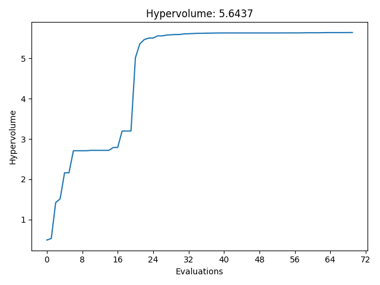

----------
Statistics
----------

Click the ``Statistics`` tab in the main window and you will see the different statistics showing the progress of optimization.

Hypervolume
-----------

Hypervolume [1]_ is the most popular performance metric in multi-objective optimzation.
Basically, hypervolume is the Lebesgue measure of the performance space region that is strictly dominated by the Pareto front points (blue), 
relative to a “worst case” reference point (red). Therefore, in 2D case, hypervolume is the union of rectangle area shown in grey between the Pareto front and the reference point.
(Here we assume the optimization is minimization).

.. figure:: ../../_static/manual/statistics/hypervolume.png
   :width: 400 px

Thus, a higher hypervolume is always desired. In AutoOED, we can see how the hypervolume is evolved with increasing number of evaluated samples, for example:

Basically, the optimization can be considered as finished when the hypervolume of the Pareto front has converged.

Model Prediction Error
----------------------

In each iteration of multi-objective Bayesian optimization, we first fit a surrogate model for each objective to predict the performance of design variables based on current evaluated data, 
then run optimization based on surrogate models instead of using real-world evaluation to boost the sample efficiency. 

Here in these plots below, we show the changes of prediction error of surrogate models with increasing number of samples.
These are the plots come from an optimization problem with two objectives, which are simply named as "f1" and "f2".

.. figure:: ../../_static/manual/statistics/model_error_curve.png
   :width: 400 px

The error is calculated as the absolute error between the predicted performance of the proposed points and the real evaluated performance in the performance space.

Ideally, the prediction error should decrease as we have more evaluated data, but this is not guaranteed because in each iteration the proposed points would be different, 
and the prediction is usually not the same accurate over the whole design space because of data imbalance. 
However, generally you should expect the prediction would be more and more accurate for the high-performing region of the design space, where we care about the most.

References
----------

.. [1] Zitzler, Eckart, and Lothar Thiele. "Multiobjective optimization using evolutionary algorithms—a comparative case study." International conference on parallel problem solving from nature. Springer, Berlin, Heidelberg, 1998.